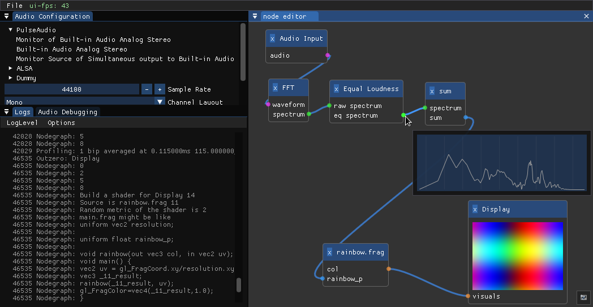

# tectogen tech demo

tectogen is an experimental graphical application to live-code, combine and music-match visual effects, provided in the form of GLSL fragment shader functions. All of this is currently in pre-alpha/tech demo stage.

## Contents

 - [Screenshot](#screenshot)
 - [Project Description](#project-description)
 - [Prerequisites](#prerequisites)
 - [Building](#building)
 - [Contributing and Feedback](#contributing-and-feedback)
 - [Roadmap](#roadmap)
 - [Logo](#logo)

## Screenshot



## Project Description

The core of tectogen's user interface is a node editor that takes sample audio as external input and screens on which to render the resulting fragment shader as external outputs.

All nodes are invoked once a tick. One tick corresponds to one buffer of audio input as well to one visualization frame. Therefore, using a hop size of 1024 samples on an audio input of 44.1kHz results in a video frame rate of about 43 Hz.

The typical visualization pipeline would first gather relevant information from the audio using a combination of the available analyses in each tick. The end-result of this stage as of now solely consists of scalar/floating point values.

Subsequently, these scalars can be post-processed using arithmetic operations.

Finally, those scalars can be connected to a combination of shader nodes where they will be available as flaot uniforms. While audio and scalar nodes operate solely on the cpu by calling their `invoke` function once every tick, the shader functions connected to a display are transparently linked into one fragment shader which will be rendered once a tick. This linkage step includes generating the GLSL source of the shaders main function.

The edges of the node graph are typed and current types are time-domain audio, frequency domain audio, scalar (floating point) and an abstract notion of color which eventually corresponds to a vec4 color value or a vec2 coordinate system passed between functions of the shaders.

Albeit the functions composing a shader are precompiled on application startup, this library of shader functions can be updated and extended in run time as GLSL sources are updated or added to the respective search directories. This allows for a live-coding approach to using the software.

To ensure that operations such as rebuilding or relinking the GLSL shaders does not affect the strictly timed nature of the visualization pipeline, tectogen is based on a multi-threaded, multi-context architecture. The asynchronous components are:

 - UI mainloop
 - CPU based parts of the visualization pipeline
 - GPU/shader based parts of the visualization pipeline
 - filesystem watch
 - shader compilation
 - initially receiving audio into fixed-size buffers

## Prerequisites

tectogen is developed in C++ with portability in mind, the tech demo currently targets OpenGL 3.2 core. While linux, particularly arch linux, as my daily driver is most supported, compatibility with Ubuntu 20.04 is regularly verified.

Past revisions of this codebas have been verified to work well on Windows, building was feasible using mingw-cross from linux as well as natively on Windows using msys. In principle, compilation using mingw-cross or msys works like building on linux provided that the respective distribution and library dependencies are correctly installed.

All dependencies should be Mac OS compatible.

## Building

Like everything in tectogen, the build flow was set up in a "works for me" manner. Please open an issue for any inconveniences you encounter.

tectogen uses the CMake build system. Dependencies which are not typically packaged by linux distributions are linked to this repository using git submodules. After cloning this repository, you can fetch those submodules using

```
git submodule update --init --recursive
```

Additionally you will need to satisfy the following dependencies (here listed by their ubuntu package names):

Compile-time: A compiler, recent `g++` and `clang` versions are confirmed to work. `cmake pkg-config libglfw3-dev libglew-dev libfftw3-dev libglm-dev` and recommended but optional `libjack-jackd2-dev`. On Linux, possibly `libpulse-dev` `libasound2-dev` depending on what audio server you want available in your build.
Run-time: `libglfw3` `libfftw3-single3` and at least one of the aforementioned audio servers actually working

Then you can build as is done with CMake, e.g.

```
cmake -Bbuild
cmake --build build
```

This will create a single binary in the build directory that, when excecuted, will search for a `shader` directory in the current path containing .frag files with the shader functions (try those from the `ext` directory) and will create an `imgui.ini` holding not only `imgui`s window/dock state and such but also some state of tectogen itself.

## Contributing and Feedback

tectogen is in a very early stage of develoment, yet any feedback is welcome. Please create a [codeberg issue](https://codeberg.org/tectogen/tectogen/issues) for:

 - Any inconvenience you encounter when trying to build, test or understand the codebase
 - Any questions that are left unanswered by this README
 - Feature requests, even the far fetched ones. Now is the perfect time to discuss future prospects
 - Bugs! I'll try file the ones I know of myself

I will try to define milestones based on the issues in the tracker.

## Roadmap

 - [ ] merge multiple shaders
 - [ ] coordinate system shaders
 - [ ] improve api, allow access to lookback buffer
 - [ ] handle frame skipping meaningfully
 - [ ] midi in- and output
 - [ ] band filtering
 - [ ] bring back the analyses
 - [ ] textures as shader inputs and -targets

## Logo


